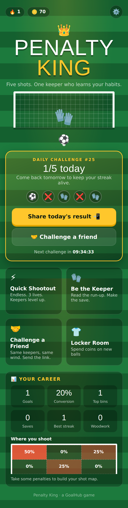
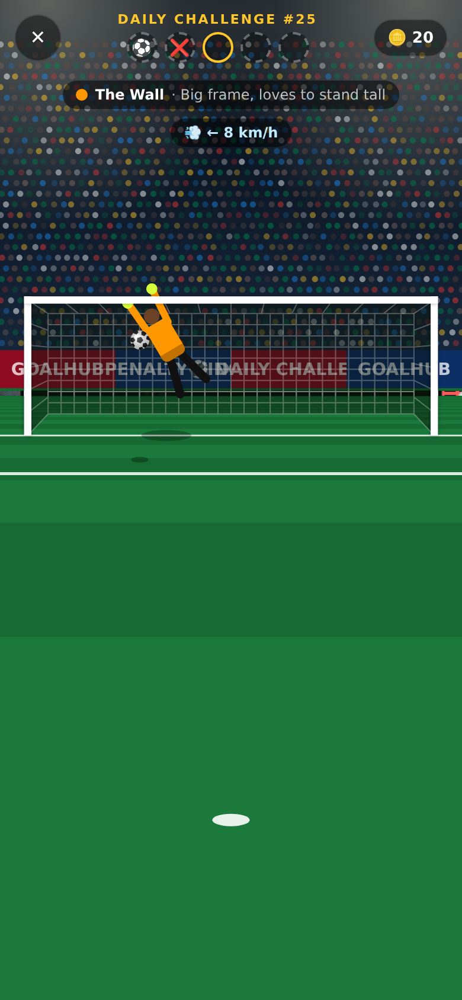
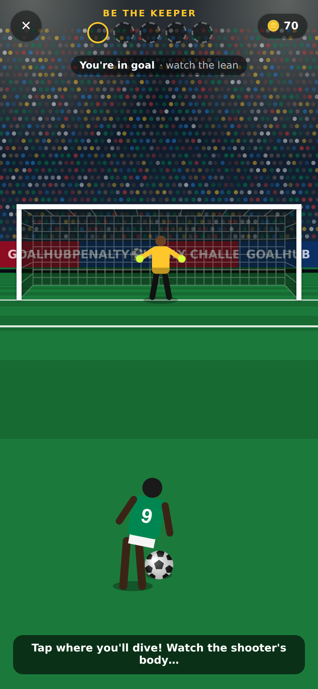
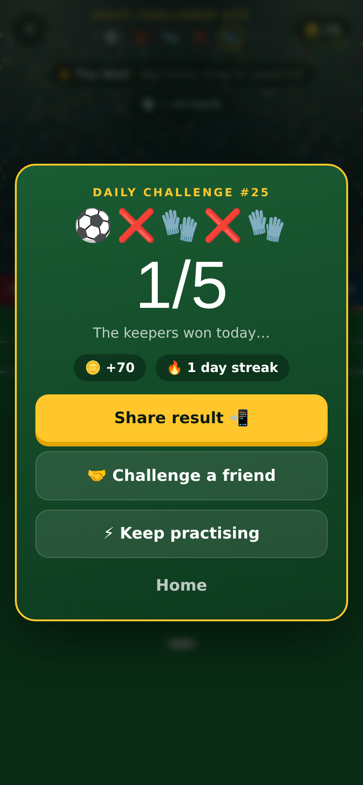

# Penalty King

A mobile-first football penalty game that runs in the browser. There's nothing to install and it works offline once loaded.

## Modes
- **Daily Challenge**: the same 5 penalties (keepers and wind) for everyone, one attempt per day, resetting at midnight UTC. Builds your streak.
- **Quick Shootout**: endless, with 3 lives. Keepers get sharper every 5 goals and wind arrives at level 3.
- **Be the Keeper**: read the shooter's body lean and tap where to dive. Dive too early and they may send you the wrong way.
- **Challenge a Friend**: sends a link with the same seeded keepers and wind, and compares scores.

## Mechanics
- **Swipe to shoot.** Longer = higher, faster = harder to save but less accurate, curved swipe = bending shot.
- **Keeper AI learns your habits.** It blends your overall shot map with what you tend to do after your last shot.
- **Four keeper personalities**: The Reader, The Gambler, The Wall, The Cat.
- **Outcomes**: post/crossbar hits, top bins, "sent the wrong way", Panenka.
- **Progression**: coins, a Locker Room of ball skins, career stats and a shot heatmap.
- **Sharing**: share cards (image + emoji text) for WhatsApp and other apps.
- **Polish**: synthesized sound, vibration, and installable as a PWA.

## Run locally
```
python3 -m http.server 8000
# open http://localhost:8000
```
All progress is stored in the browser's localStorage. There is no backend yet.

| Home | Shooting | Keeper | Results |
|---|---|---|---|
|  |  |  |  |
